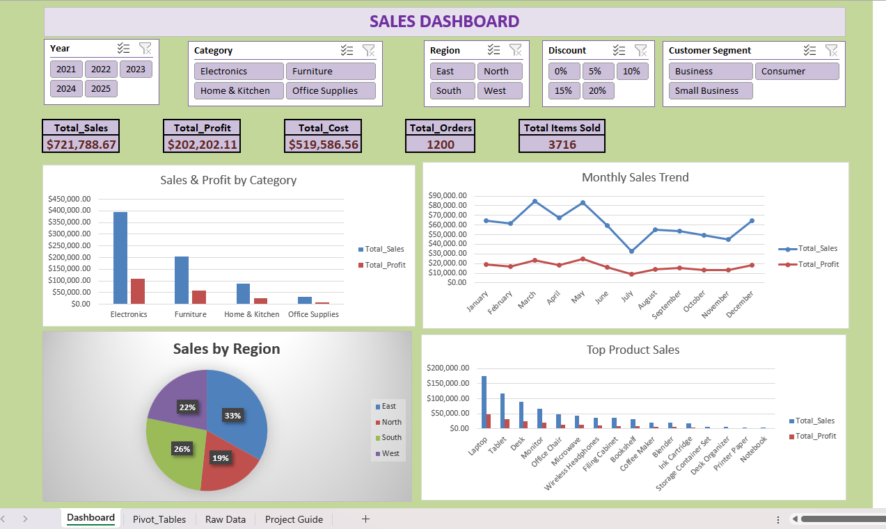
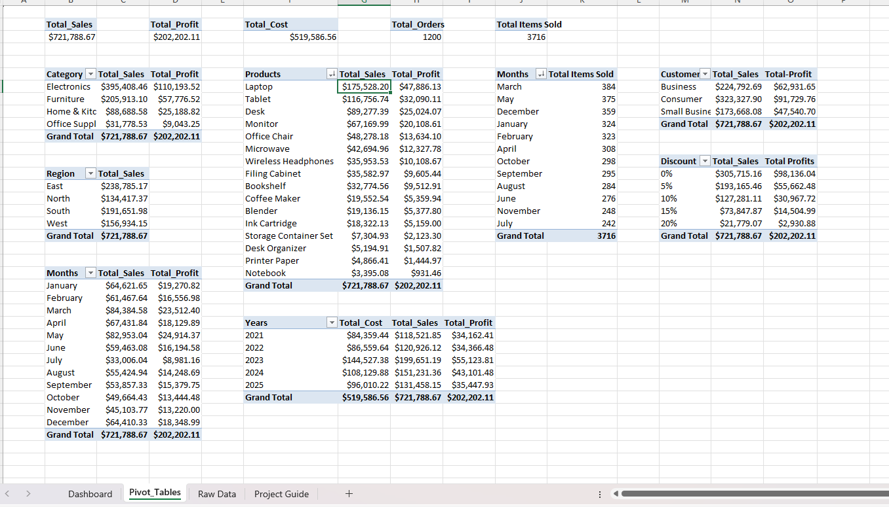
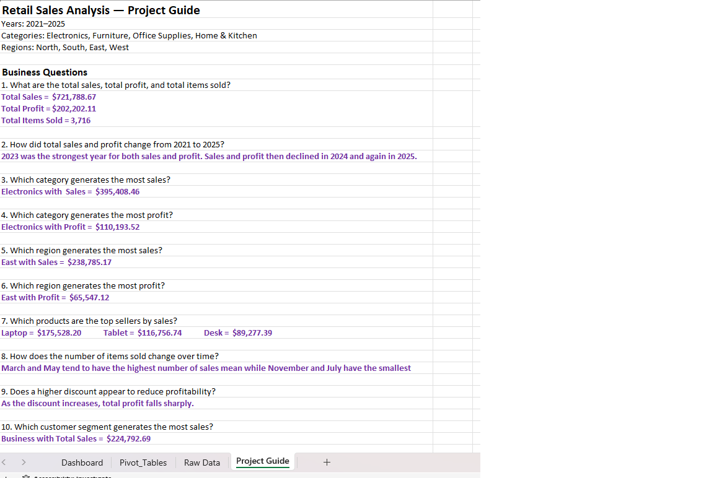
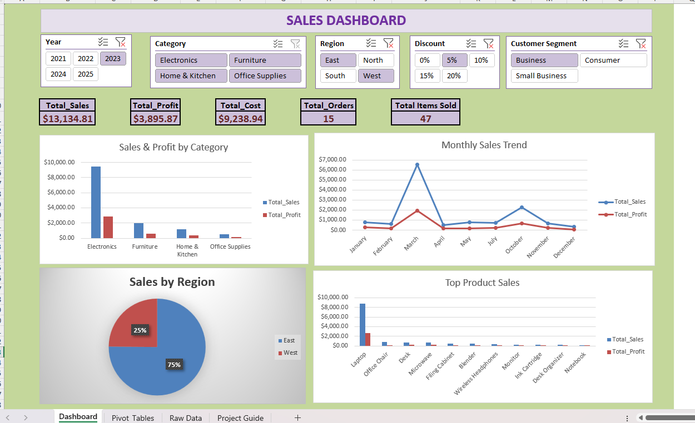

# Retail Business Sales Analysis (2021–2025)

## Project Overview

This project uses Microsoft Excel to analyze retail sales, profitability, product performance, and regional trends from 2021 to 2025. The objective is to transform raw transaction data into actionable business insights that support data-driven decision-making.

## Key Performance Indicators

- **Total Sales:** $721,788.67
- **Total Profit:** $202,202.11
- **Total Cost:** $519,586.56
- **Total Orders:** 1,200
- **Total Items Sold:** 3,716
- **Profit Margin:** 28.01%

## Business Questions

1. What are the total sales, total profit, and total items sold?
2. How did sales and profit change between 2021 and 2025?
3. Which product category generates the most sales?
4. Which product category generates the most profit?
5. Which region generates the most sales?
6. Which region generates the most profit?
7. Which products are the top performers by sales?
8. How do items sold change over time?
9. How do discounts relate to profitability?
10. Which customer segment generates the most sales?

## Key Insights

- **Electronics** generated the highest sales and profit among product categories.
- **East** was the leading region by sales.
- **Laptops** were the top-performing product by sales.
- Annual sales and profit peaked in 2023, followed by declines in 2024 and 2025.
- Monthly sales varied throughout the year.
- Higher discount levels were associated with lower total profit in this dataset.

## Dashboard Features

- KPI reporting for sales, profit, cost, orders, and items sold.
- Category-level sales and profit comparisons.
- Monthly sales trend analysis.
- Regional sales distribution.
- Top product sales analysis.
- Interactive slicers for year, category, region, discount, and customer segment.

## Project Screenshots

### 1. Final Sales Dashboard

### 2. PivotTable Analysis

### 3. Business Questions

### 4. Dashboard with Year, Region, Discount, and Customer Segment Filters

## Tools and Skills Demonstrated

- Microsoft Excel
- Data analysis and organization
- PivotTables and PivotCharts
- Interactive slicers and filtering
- KPI development and reporting
- Dashboard design and data visualization
- Sales and profitability analysis
- Trend and regional performance analysis
- Business insight communication

## Project Files

- `Retail_Business_Sales_Analysis_2021_2025.xlsx` — Excel workbook containing the raw data, PivotTables, dashboard, and project guide.
- `README.md` — Project documentation.
- `01_Final_Sales_Dashboard.png` — Final dashboard screenshot.
- `02_Pivot_Table_Analysis.png` — PivotTable analysis screenshot.
- `03_Business_Questions.png` — Business questions screenshot.
- `04_Dashboard_Year_Filter.png` — Filtered dashboard screenshot.

## Conclusion

This project demonstrates practical Excel data analytics skills by transforming 1,200 retail transactions into an interactive dashboard. It showcases the ability to summarize KPIs, evaluate product and regional performance, analyze trends, and investigate the relationship between discounts and profitability.

The project reflects my continued development as a data analyst, with an emphasis on practical analysis, clear reporting, and data-driven business decisions.
